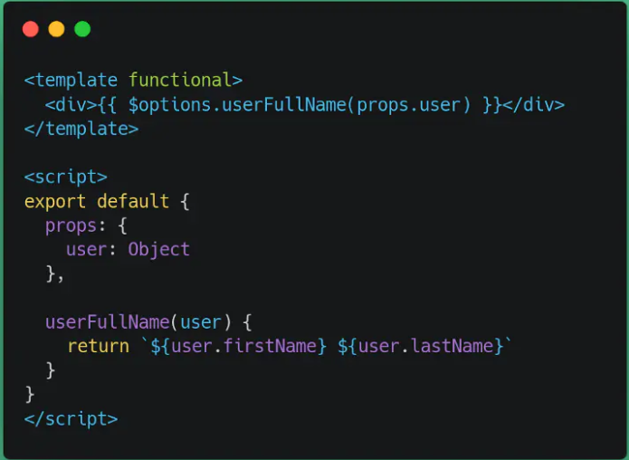

# 基于 vuecli3.0 的性能优化方案

### 尽量减少 HTTP 请求数量(数量层面)

- `css`/`js`合并打包

  在内管系统中,`css` 样式的体积很小,所以将 `css` 打包进 `css` 文件，可以减少请求的数量，但在 `c` 端，`css` 样式所占的体积挺大，所以可以把 `css` 单独打包成一个文件，尽量控制每一个文件的大小在 25~30`kb`.

  `vue-cli 3.0`中,这样设置

  ```js
  css: {
    // 是否将css提取为单独的文件
    extract: false
  }
  ```

- 用`iconfont`代替小图标

- 用`base64`格式的图片代替色彩复杂的小图片(大小不超过 6kb,不然转成`base64`之后体积会变大)，可以通过`webpack`设置,使用`base64`位图片能减少 `Http` 请求数量

  `vue-cli 3.0`中：

  ```js
  module.exports = {
    chainWebpack: (config) => {
      config.module
        .rule('images')
        .use('url-loader')
        .loader('url-loader')
        .tap((options) => Object.assign(options, { limit: 10000 }))
    },
  }
  ```

- 使用雪碧图,但操作很麻烦，建议通过前面两种来优化小图片

  如果非要使用的话，可以使用`webpack-spritesmith`插件

  ```js
   //npm install webpack-spritesmith

   const SpritesmithPlugin = require('webpack-spritesmith')

     configureWebpack: config => {
     if (process.env.NODE_ENV === 'production') {
       return {
         plugins: [
             new SpritesmithPlugin({
               src: {
                 //存放icon的目录，以及图片的后缀名
                 cwd: path.resolve(__dirname, 'src/assets/img'),
                 glob: '*.png'
               },
               target: {
                 //打包生成后的css文件(scss文件)，以及合成的雪碧图的文件
                 image: path.resolve(__dirname, 'dist/assets/img/sprite.png'),
                 css: path.resolve(__dirname, 'dist/assets/css/sprite.css')
               },
               apiOptions: {
                 //特殊的参数配置，具体参考文档
                 cssImageRef: '~sprite.png'
               }
             })
         ]
       }
     }
   },
  ```

### 静态资源的体积压缩与合并(大小层面)

- 静态资源压缩,对打包文件进行压缩

  - 大文件进行拆分,小文件进行合并，尽量保证每个资源的大小在 25~30kb

- 减少`css`嵌套,不要超过三层

- 开启`gzip`压缩

  目前`vue-cli3.0`本身并没有提供这个配置，需要自己进行配置。具体的配置：

  ```js
  //npm install compression-webpack-plugin

  const CompressionPlugin = require('compression-webpack-plugin')

  configureWebpack: (config) => {
    if (process.env.NODE_ENV === 'production') {
      return {
        plugins: [
          new CompressionPlugin({
            test: /\.js$|\.html$|\.css/,
            threshold: 10240, // 对超过10k的数据进行压缩
            deleteOriginalAssets: false,
          }),
        ],
      }
    }
  }
  ```

  关于`gzip`压缩，目前大部分的浏览器都支持，只要在请求头的`Accept-Encoding: gzip, deflate, br`(`deflate`, `br`对应的是其他两种压缩方式)有这个声明，然后服务端根据这个请求返回对应的`.gz`文件，然后浏览器自己做解压，就可以了。

- 动态导入

  - 使用方式

  ```js
  component: () => import(/* webpackChunkName: "home"*/ '@views/home/home.vue')
  ```

  - `webpack`会对动态导入的模块做单独打包,代码分割打包

  - 动态导入的模块会在使用它的时候才加载

### 使用缓存

- 设置强缓存

  - `Cache-Control`

  - `expires`

- 设置协商缓存

  - `Last-Modify` 与 `If-Modify-Since`

  - `Etag` 与 `If-None-Match`

### CDN

可以把一些比较大的依赖包,改为外部`CDN`引入的方式,这样可以减少`webpack`依赖包的打包体积。

如在内管系统中,可以把`vue`和`element-ui`抽离出去

```html
<!-- public/index.html -->
<!DOCTYPE html>
<html lang="en">
  <head>
    <meta charset="utf-8" />
    <meta http-equiv="X-UA-Compatible" content="IE=edge" />
    <meta name="google" content="notranslate" />
    <meta name="viewport" content="width=device-width,initial-scale=1.0" />
    <link rel="icon" href="<%= BASE_URL %>favicon.ico" />
    <title>****</title>
    <!-- 引入样式 -->
    <% for(var css of htmlWebpackPlugin.options.cdn.css) { %>
    <link rel="stylesheet" href="<%=css%>" />
    <% } %>
  </head>
  <body>
    <noscript>
      <strong
        >We're sorry but opcenter doesn't work properly without JavaScript enabled. Please enable it
        to continue.</strong
      >
    </noscript>
    <!-- 引入JS -->
    <% for(var js of htmlWebpackPlugin.options.cdn.js) { %>
    <script src="<%=js%>"></script>
    <% } %>
    <div id="app"></div>
    <!-- built files will be auto injected -->
  </body>
</html>
```

```js
//vue.config.js

 chainWebpack: config => {
  const cdn = {
    css: [
      // element-ui css
      'https://unpkg.com/element-ui@2.10.1/lib/theme-chalk/index.css'
    ],
    js: [
      // vue must at first!
      'https://unpkg.com/vue@2.6.10/dist/vue.js',
      // element-ui js
      'https://unpkg.com/element-ui@2.10.1/lib/index.js'
    ]
  }
  config.plugin('html').tap(args => {
    args[0].cdn = cdn
    return args
  })
},
configureWebpack: config => {
  config.externals = {
    vue: 'Vue',
    'element-ui': 'ELEMENT'
  }
},
```

```js
//main.js
//删除之前引入的element样式文件
import ELEMENT from 'element-ui'
Vue.use(ELEMENT)
```

### 图片格式优化

- `JPG`格式适用于色彩丰富的图片,常用于大的背景图,轮播图或`Banner`图

- `Logo`,颜色简单且对比强烈的的图片,需要透明度的，采用`png`格式

- 雪碧图

- 小于`6kb`的转`base64`

- `webp`,各方面都很好,但是兼容性差,有条件的可以对它进行兼容使用

- 图片懒加载

### vue 代码层面的优化

- 利用`Object.freeze()`提升性能

  让数据不需要响应式

  目前我发现的最合适用的场景是`报表`(列表)或者其他与页面视图渲染无关的数据

  ```js
  //...
  let merInfoList = responseData.data.merInfoList
  this.componentTableData = Object.freeze(merInfoList)
  //...
  ```

- `functional component`

  当一个组件，只需要通过`props`来控制状态，而不需要使用`state`的时候，可以使用`function component`来优化性能。

  

- 子组件拆分

  如果父组件需要频繁的更改样式(重新渲染),但是其内部的数据处理不需要改变，那么把处理数据的单独抽成组件，这样父组件样式改变时,子组件不会重新渲染.

  ```js
    <template>
    <div :style="{ opacity: number / 300 }">
      <div>{{ heavy() }}</div>
    </div>
    </template>

    <script>
    export default {
      props: ['number'],
      methods: {
        heavy () { /* 长任务 */ }
      }
    }
    </script>
  ```

  ```js
  <template>
  <div :style="{ opacity: number / 300 }">
    <ChildComp/>
  </div>
  </template>
  <script>
  export default {
    props: ['number'],
    components: {
      ChildComp: {
        methods: {
          heavy () { /* 长任务在子组件里。 */ }
        },
        render (h) {
          return h('div', this.heavy())
        }
      }
    }
  }
  </script>
  ```

- 通过`v-show`重用组件

`v-if`会重复的销毁和创建组件,`v-show`只是控制组件的显示和隐藏。对于一些开销比较大的组件,可以通过`v-show`来控制,这样就可以重用这个组件。

- `keep-alive`缓存页面

- 大数据量下的处理情况

  只渲染在屏幕中出现的组件,`vue-virtual-scroller`库

- `v-for`遍历避免同时使用`v-if`

- 事件销毁，如在`beforeDestory`事件，清空定时器等

- 第三方库按需导入
